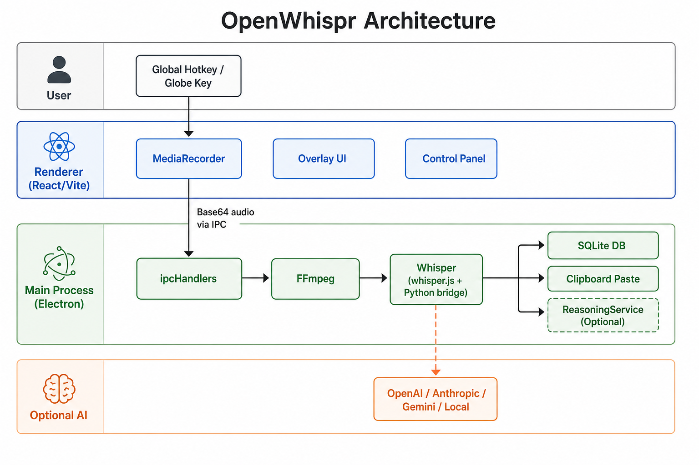

# AGENTS.md — OpenWhispr Agent Onboarding

> **Repo folder may be named `Wispr-Flow`; the app is OpenWhispr (`open-whispr` v1.0.12).**

## What This App Does

OpenWhispr is an open-source **Electron desktop dictation app**. The user presses a global hotkey (default: backtick `` ` ``), speaks, and the app:

1. Records audio via MediaRecorder in the renderer
2. Transcribes with **OpenAI Whisper** (local Python bridge or cloud API)
3. Optionally processes agent-addressed commands via multi-provider AI
4. Auto-pastes the result at the cursor



## Tech Stack

| Layer | Stack |
|-------|-------|
| Frontend | React 19, TypeScript, Tailwind CSS v4, Vite, shadcn/ui |
| Desktop | Electron 36, context isolation, preload bridge |
| Main process | Node.js helpers, better-sqlite3, ffmpeg-static |
| Speech | `whisper_bridge.py` (local), OpenAI Whisper API (cloud) |
| AI reasoning | ReasoningService.ts — OpenAI, Anthropic, Gemini, local |

## How to Run

```bash
npm install          # postinstall rebuilds better-sqlite3
npm run dev          # Vite (port 5174) + Electron with hot reload
```

Optional: `npm run setup` creates `.env` from template (cloud keys only; never commit `.env`).

Build unsigned app: `npm run pack` → `dist/mac-arm64/OpenWhispr.app`

## Where Code Lives

| Area | Key files |
|------|-----------|
| **Main process** | `main.js`, `preload.js`, `src/helpers/*.js` |
| **IPC** | `src/helpers/ipcHandlers.js` — register all channels here + `preload.js` |
| **Renderer UI** | `src/App.jsx` (overlay), `src/components/ControlPanel.tsx` (settings) |
| **Hooks** | `src/hooks/` — settings, audio, hotkey, whisper, permissions |
| **AI** | `src/services/ReasoningService.ts` |
| **Python bridge** | `whisper_bridge.py` |
| **Globe key (macOS)** | `resources/macos-globe-listener.swift`, built via `npm run compile:globe` |

## Dual-Window Architecture

- **Main window**: Minimal draggable overlay for dictation (always on top)
- **Control panel**: Full settings, history, model management
- Same React codebase; route via URL (`?panel=control` or similar)

## Audio Pipeline (Summary)

Hotkey → MediaRecorder → Blob → Base64 → IPC → temp file → FFmpeg → Whisper → (optional ReasoningService) → clipboard paste + SQLite history

## Conventions for Changes

- **New IPC channel**: Add handler in `ipcHandlers.js` AND expose in `preload.js`
- **New setting**: Update `useSettings.ts` + `SettingsPage.tsx`
- **New helper module**: Create in `src/helpers/`, initialize in `main.js`
- **UI component**: Follow shadcn/ui patterns in `src/components/ui/`
- **Debug mode**: `OPENWHISPR_DEBUG=true` or `--debug` flag (see `DEBUG.md`)

## Do NOT Commit

- `.env` (API keys)
- `node_modules/`, `dist/`
- User data, logs, cached Whisper models

## Deeper Reference

| Doc | Purpose |
|-----|---------|
| [CLAUDE.md](CLAUDE.md) | Full technical reference (317 lines) |
| [docs/QUICKSTART.md](docs/QUICKSTART.md) | Condensed run/build guide |
| [docs/ARCHITECTURE.md](docs/ARCHITECTURE.md) | Mermaid diagrams + file map |
| [DEBUG.md](DEBUG.md) | Debug logging and triage |
| [TROUBLESHOOTING.md](TROUBLESHOOTING.md) | Common user issues |
| [LOCAL_WHISPER_SETUP.md](LOCAL_WHISPER_SETUP.md) | Local Whisper setup |

## Project Skills (`.cursor/skills/`)

- `openwhispr-dev-setup` — install, dev, pack, env, Globe key
- `openwhispr-debug` — debug logging, FFmpeg/Python/Whisper triage
