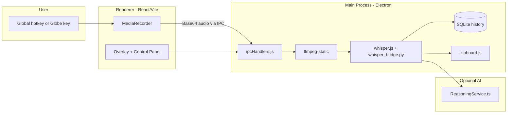
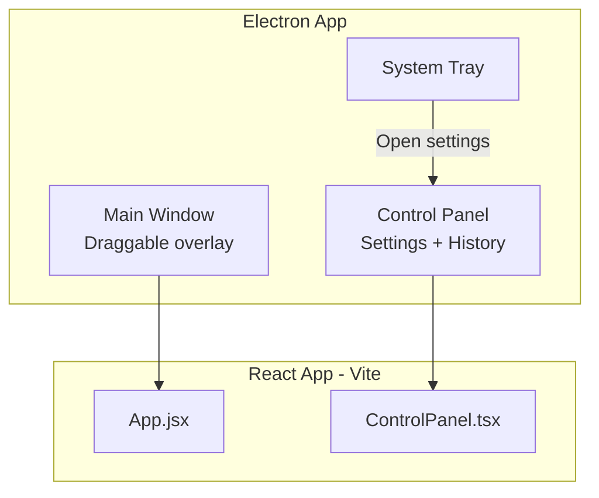
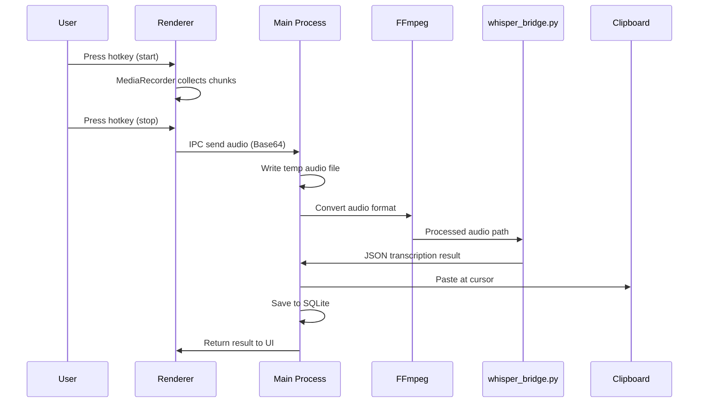
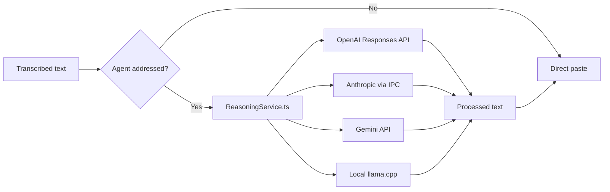

# OpenWhispr Architecture

Visual overview: [assets/architecture-overview.png](assets/architecture-overview.png)

## System Overview

## Dual-Window Model

Both windows share the same React codebase. Routing distinguishes overlay vs control panel.

## Audio Pipeline

## Reasoning Flow (Agent Commands)

Agent name detected via "Hey [AgentName]" pattern. Agent reference removed from final output.

## File Map

| Layer | Path | Role |
|-------|------|------|
| Entry | `main.js` | Electron bootstrap, manager init |
| Bridge | `preload.js` | Secure `window.api` IPC surface |
| IPC | `src/helpers/ipcHandlers.js` | All IPC channel handlers |
| Audio | `src/helpers/whisper.js` | Whisper orchestration |
| DB | `src/helpers/database.js` | SQLite transcription history |
| Paste | `src/helpers/clipboard.js` | Cross-platform paste |
| Python | `whisper_bridge.py` | Local Whisper transcription |
| Overlay | `src/App.jsx` | Dictation UI |
| Settings | `src/components/ControlPanel.tsx` | Control panel |
| AI | `src/services/ReasoningService.ts` | Multi-provider reasoning |
| Hooks | `src/hooks/` | Settings, audio, hotkey, permissions |

## Process Boundaries

- **Renderer**: React UI, MediaRecorder, no Node.js access
- **Preload**: Context-isolated bridge (`window.api`)
- **Main**: File I/O, native modules, Python spawn, clipboard, DB
- **Python**: Stateless Whisper transcription (30s timeout)

## Further Reading

- [CLAUDE.md](../CLAUDE.md) — comprehensive technical reference
- [AGENTS.md](../AGENTS.md) — agent onboarding
- [QUICKSTART.md](QUICKSTART.md) — run guide
